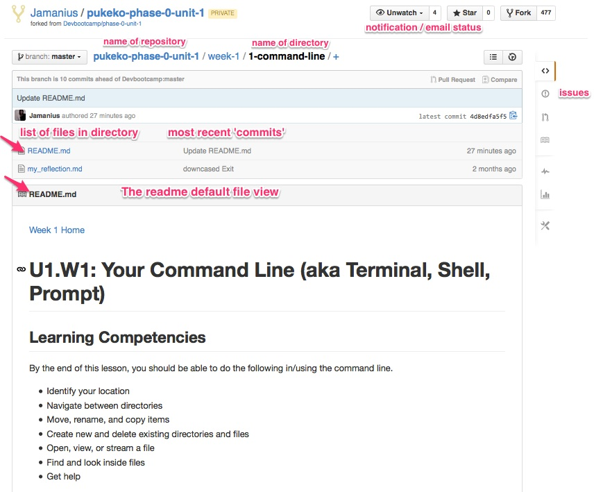
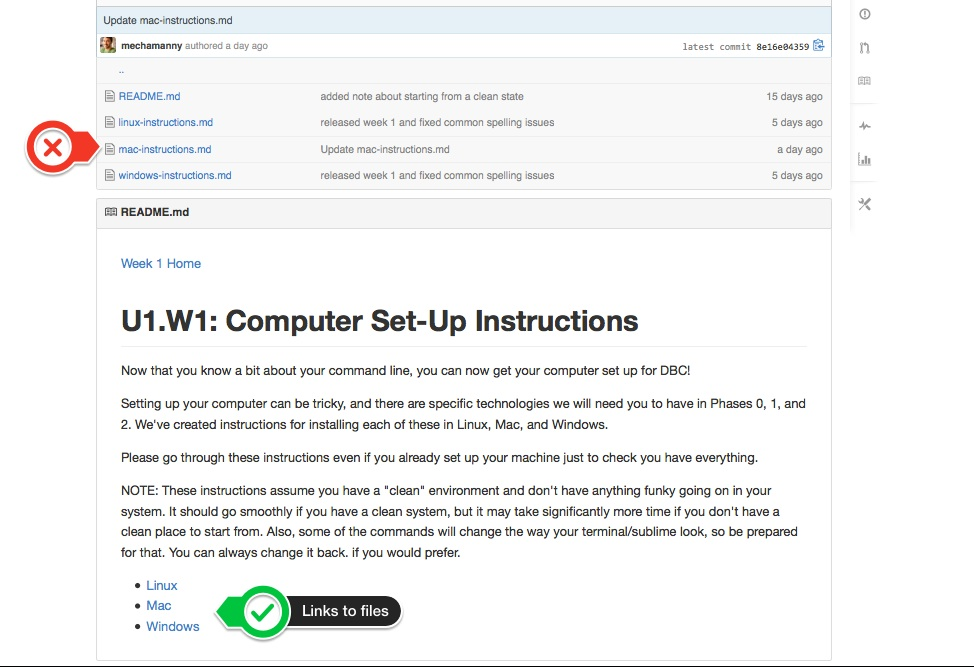

# U0.W1: Oh Github! What an odd interface you have!


```
Git is one of the most popular version control systems and is quickly gaining prominence. It is used on multiple cloud hosting 
services, including Amazon’s EC2 and Heroku, and has vibrant usage among top open source communities. Which means that if you 
want to make use of Amazon or Heroku’s awesome server power or contribute your code to an opensource project, you have to know 
how to participate by using git.
```

##### How Git works
Git is an open-source version control system (meaning, it’s free!) that allows developers to track changes made on 
their code files throughout the lifetime of a project. Git is designed such that it views your code files like a “tree” and 
allows you to do cool things like create a “branch” where you work on some of the files without affecting the “trunk” code 
base until you are sufficiently convinced that the changes you are making are good and won’t break the rest of the tree.

</br>  
</br>  

##### Navigating GitHub
In each repository (repo) there are a number of directories (folders) and files. By default the README.md file should be visible below the list.  

</br>  
</br>  

------------------------------



*Figure 1.* The Github layout 

------------------------------
 
</br>  
</br>  

##### Find the readme

For the most part you can ignore the 'list of files in directory'. The readme will usually direct you to where you need to go. Note however, that this is not always the case, and the directory structure is a great way to get around once your familiar with it. 

</br>  
</br>  

------------------------------



*Figure 2.* Multiple files and directories 

------------------------------

</br>  
</br>  

# The challenges on github - Releases!
You'll use github for pretty much all of your challenges. Most of the tasks that you need to complete are called "Releases" - and they are usually preceded with context and information. It's usually the point at which you commit your work (save it and push it to the cloud). The github challenges in this week will help you learn how to do this. 

##### To the [challenges](../README.md)


